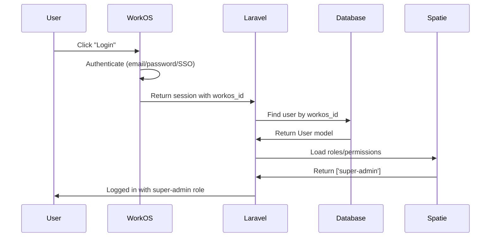

# WorkOS + Spatie Permissions Integration

## Current Setup

**WorkOS**: Handles authentication only
- Stores `workos_id` on users
- No role/permission management
- Users login via WorkOS AuthKit

**Spatie Permission**: Installed but unused
- `HasRoles` trait already on User model
- Roles/permissions stored locally in Laravel

## Existing Users

```php
// From UserSeeder.php

// 1. admin@disburse.cash (System Admin)
- workos_id: 'user_01K9V1DWFP0M2312PPCTHKPK9C'
- Current: Has 'super-admin' role (line 28)
- Keep: ✅ Already correct

// 2. lester@hurtado.ph (Power User / Main Tester)  
- workos_id: 'user_01K9H6FQS9S11T5S4MM55KA72S'
- Current: No role, uses ADMIN_OVERRIDE_EMAILS .env hack
- Migrate: Assign 'super-admin' role
```

## Integration Strategy

WorkOS and Spatie work **independently**:

```
┌─────────────────────────────────────────────┐
│ WorkOS AuthKit (External)                  │
│ - Authenticates user                        │
│ - Returns workos_id                         │
│ - User login/logout flow                    │
└─────────────────────────────────────────────┘
              ↓ (After login)
┌─────────────────────────────────────────────┐
│ Laravel App (Local)                         │
│ - Finds user by workos_id                   │
│ - Loads Spatie roles/permissions            │
│ - Checks: $user->can('view-pricing')        │
│ - Checks: $user->hasRole('admin')           │
└─────────────────────────────────────────────┘
```

**Key Point**: Roles are **NOT** synchronized from WorkOS. They're managed locally in Laravel using Spatie.

## Updated UserSeeder

```php
<?php

namespace Database\Seeders;

use App\Models\User;
use Illuminate\Database\Seeder;
use Spatie\Permission\Models\Role;

class UserSeeder extends Seeder
{
    /**
     * Run the database seeds.
     */
    public function run(): void
    {
        // Ensure roles exist (run RolePermissionSeeder first)
        $superAdmin = Role::firstOrCreate(['name' => 'super-admin']);
        
        // ═══════════════════════════════════════════════════════
        // 1. System Admin (admin@disburse.cash)
        // ═══════════════════════════════════════════════════════
        $systemEmail = env('SYSTEM_USER_ID', 'admin@disburse.cash');
        $admin = User::updateOrCreate(
            ['email' => $systemEmail],
            [
                'name' => 'System Administrator',
                'workos_id' => 'user_01K9V1DWFP0M2312PPCTHKPK9C',
                'avatar' => 'https://ui-avatars.com/api/?name=System+Admin&background=random',
            ]
        );

        // Assign super-admin role
        if (!$admin->hasRole('super-admin')) {
            $admin->assignRole('super-admin');
            $this->command->info("✅ Assigned 'super-admin' role to: {$admin->email}");
        }

        // ═══════════════════════════════════════════════════════
        // 2. Power User / Main Tester (lester@hurtado.ph)
        // ═══════════════════════════════════════════════════════
        $powerUser = User::updateOrCreate(
            ['email' => 'lester@hurtado.ph'],
            [
                'name' => 'Lester Hurtado',
                'workos_id' => 'user_01K9H6FQS9S11T5S4MM55KA72S',
                'avatar' => 'https://workoscdn.com/images/v1/SWYo_esN8VqHMcvV6Z1SQZ0c8cAmKIr4AT_cKrzmICA',
            ]
        );

        // ⚠️ CHANGE: Assign super-admin role (replaces ADMIN_OVERRIDE_EMAILS)
        if (!$powerUser->hasRole('super-admin')) {
            $powerUser->assignRole('super-admin');
            $this->command->info("✅ Assigned 'super-admin' role to: {$powerUser->email}");
        }

        // ═══════════════════════════════════════════════════════
        // Summary
        // ═══════════════════════════════════════════════════════
        $this->command->info("✅ System Admin: {$admin->email}");
        $this->command->info("✅ Power User: {$powerUser->email}");
        $this->command->info("");
        $this->command->info("📝 Use /dev-login/{email} in local environment");
        $this->command->info("🔐 In production, users login via WorkOS AuthKit");
        $this->command->info("🎭 Roles managed locally via Spatie Permission");
    }
}
```

## Migration Plan

### Step 1: Update DatabaseSeeder Order

```php
// database/seeders/DatabaseSeeder.php
public function run(): void
{
    // IMPORTANT: Run in this order
    $this->call([
        RolePermissionSeeder::class,  // 1. Create roles/permissions first
        UserSeeder::class,              // 2. Then create users with roles
        SystemWalletSeeder::class,      // 3. Other seeders
        VoucherSettingsSeeder::class,
        InstructionItemSeeder::class,
    ]);
}
```

### Step 2: Update RolePermissionSeeder

Keep the existing seeder but ensure it runs first:

```php
// database/seeders/RolePermissionSeeder.php
public function run(): void
{
    // Reset cached roles and permissions
    app()[\Spatie\Permission\PermissionRegistrar::class]->forgetCachedPermissions();
    
    // Create permissions (keep existing)
    $permissions = [
        'generate-vouchers',
        'view-vouchers',
        'export-vouchers',
        'use-advanced-mode',
        'use-validation-location',
        'use-validation-time',
        'view-pricing',
        'edit-pricing',
        'view-balances',
        // ... etc
    ];
    
    foreach ($permissions as $permission) {
        Permission::firstOrCreate(['name' => $permission]);
    }
    
    // Create super-admin role with all permissions
    $superAdmin = Role::firstOrCreate(['name' => 'super-admin']);
    $superAdmin->givePermissionTo(Permission::all());
    
    // Other roles...
    $admin = Role::firstOrCreate(['name' => 'admin']);
    $manager = Role::firstOrCreate(['name' => 'manager']);
    $betaTester = Role::firstOrCreate(['name' => 'beta-tester']);
    $user = Role::firstOrCreate(['name' => 'user']);
    
    // Assign permissions to roles...
}
```

### Step 3: Remove ADMIN_OVERRIDE_EMAILS (After Testing)

Once you verify both users have super-admin role:

```bash
# In .env - REMOVE this line:
# ADMIN_OVERRIDE_EMAILS=lester@hurtado.ph

# In .env.example - REMOVE this line:
# ADMIN_OVERRIDE_EMAILS=

# Delete config file
rm config/admin.php

# Delete middleware
rm app/Http/Middleware/AllowAdminOverride.php

# Update app/Http/Kernel.php - remove from $middlewareGroups
```

### Step 4: Update Routes

```php
// routes/web.php

// OLD (using admin.override middleware)
Route::middleware(['auth', 'admin.override'])->group(function () {
    Route::get('/admin/pricing', ...);
});

// NEW (using Spatie permission)
Route::middleware(['auth', 'can:view-pricing'])->group(function () {
    Route::get('/admin/pricing', ...);
});

// OR use role check
Route::middleware(['auth', 'role:super-admin|admin'])->group(function () {
    Route::get('/admin/pricing', ...);
});
```

## Testing Workflow

### 1. Fresh Database Setup

```bash
# Drop everything
php artisan db:wipe

# Run migrations
php artisan migrate

# Run seeders (in order)
php artisan db:seed
```

### 2. Verify Roles Assigned

```bash
# Check roles via Tinker
php artisan tinker

# Check admin@disburse.cash
$admin = User::where('email', 'admin@disburse.cash')->first();
$admin->roles->pluck('name'); // Should show ['super-admin']
$admin->can('view-pricing'); // Should be true

# Check lester@hurtado.ph
$lester = User::where('email', 'lester@hurtado.ph')->first();
$lester->roles->pluck('name'); // Should show ['super-admin']
$lester->can('view-pricing'); // Should be true
```

### 3. Test Login & Access

```bash
# Local dev login
/dev-login/lester@hurtado.ph

# Should have access to:
- /admin/pricing ✅
- /balances ✅
- Advanced Mode toggle ✅
- All experimental features ✅
```

## WorkOS Authentication Flow



**Key Points:**
- WorkOS only handles authentication
- After login, Laravel loads Spatie roles from local DB
- No API calls to WorkOS for permission checks
- All authorization happens locally

## Future: Role Management UI (Optional)

If you want to manage roles via UI:

```php
// routes/web.php
Route::middleware(['auth', 'role:super-admin'])->group(function () {
    // User management
    Route::get('/admin/users', [UserController::class, 'index']);
    Route::post('/admin/users/{user}/roles', [UserController::class, 'assignRole']);
    Route::delete('/admin/users/{user}/roles/{role}', [UserController::class, 'removeRole']);
    
    // Role management
    Route::get('/admin/roles', [RoleController::class, 'index']);
    Route::post('/admin/roles/{role}/permissions', [RoleController::class, 'assignPermission']);
});
```

This lets super-admins manage roles without touching code.

## Migration Checklist

- [ ] Update DatabaseSeeder to run RolePermissionSeeder first
- [ ] Update UserSeeder with new code (assign super-admin to both users)
- [ ] Run `php artisan db:seed --class=RolePermissionSeeder`
- [ ] Run `php artisan db:seed --class=UserSeeder`
- [ ] Test: `php artisan tinker` - verify both users have super-admin role
- [ ] Test: Login as lester@hurtado.ph, access /admin/pricing
- [ ] Test: Login as admin@disburse.cash, access /admin/pricing
- [ ] Update routes to use `can:` or `role:` middleware
- [ ] Remove AllowAdminOverride middleware from Kernel
- [ ] Remove ADMIN_OVERRIDE_EMAILS from .env
- [ ] Delete config/admin.php
- [ ] Delete app/Http/Middleware/AllowAdminOverride.php
- [ ] Update documentation

## Summary

✅ **WorkOS = Authentication only** (like Auth0, Okta)
✅ **Spatie = Authorization** (roles/permissions stored locally)
✅ **No synchronization needed** - they work independently
✅ **Both users get super-admin role** - replacing .env hack
✅ **Clean, standard Laravel pattern** - no custom middleware

This is the proper Laravel way! 🎯
